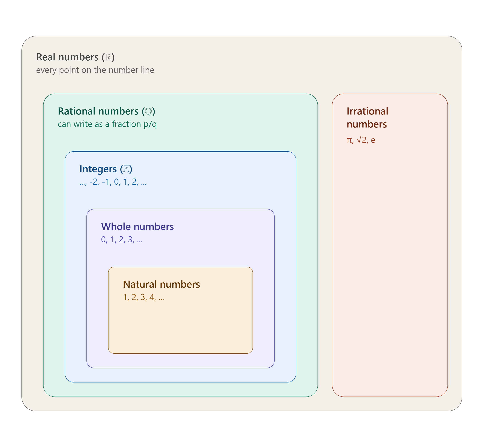

# Why should I care about *math/numbers/data* ?

> Is this even useful?

## We like to be **Right**

[**Predict Stuff**]{.fragment fragment-index='1'}
<br><br>
[*Who wins elections? See @electionandgames*]{.fragment fragment-index='4'}
<br><br>
[**Understand Stuff**]{.fragment fragment-index='2'}
<br><br>
[*Does Indian Judiciary have an in-group bias? see @aabbcdgns2025bias*]{.fragment fragment-index='5'}
<br><br>
[**Prove People wrong**]{.fragment fragment-index='3'}
<br>
[*Assess the Claim:* "The Bihar government recruited X numbers of people for a certain position (police constable). A news anchor highlights that two coaching centers in Bihar claim that a total number A and B of their students respectively cleared the exam. She points out that A+B > X. Which implies there is something off about the claims of coaching centers."]{.fragment fragment-index='6'}

## Path to predict and understand stuff, and to prove people wrong

<br><br>

1. Develop a good number sense
2. Use "Math/logic" to assess claims
3. Learn how to communicate quantitative arguments well

<br>

> All this requires learning the application of Mathematical tools

# Numbers

<br>

> A quick intro on types of numbers

## Counting Sheep

<br>

> Life in the old days was simple. If you had wordly possessions, you could count them.

Sheep, stars, pots, horses... 
<br><br>
**Natural Numbers** are referred to those numbers that were used to count physical stuff.
<br>

> 1, 2, 3, ..... as far as you could count and more 

## Counting Nothing

<br>

> There was no symbol for representing *"nothing"*, until 0

<br>

*All Natural Numbers*, along with 0 are referred to as **Whole Numbers**

## Recording debt
<br>

>Back in the day Merchants in had a hard time recording loss and debt

<br><br>

That is till **Negative Numbers** came around. All negative numbers, 0, and all natural numbers are called **integers**.

## A slice of pizza

<br><br>

> Not all things can be counted as whole or complete. 

<br>

These numbers are **Rational Numbers**

## All together



# Data 


> How does our world become data?

Definitions -> Measurements -> organised format

<br>

*There are limitations to using data as a source of knowledge*


## Agreeing on something is not so easy

<br>  

> Try to explain what is a sandwich, i.e., define Sandwich.  

::: aside
This is where I learnt that the right way to spell Sandwich is not Sandwhich or worse Sandwitch.
:::

## Does any of these fall into your definition of Sandwich? {.nostretch}


::: {#fig-sandwich layout-ncol=3}

{height="550"}

{height="550"}

{height="550"}

Sandwich?

:::


## So, we need precise definitions

<br>  

> Explain the case of counting number of trees from @spiegelhalter2019art. Besides arriving at appropriate definitions, the example also has a flavour of sampling and estimation. Did you notice?

<br>  

**Ideally, we would like to define the subject of our interest in a way that it *precisely* identifies our subject of interest. Nothing more, nothing less.**

## A precise/rigorous definition

<br>  
[Precisely identifies what we want to observe/record]{.fragment fragment-index='1'}
<br>  
[Stands true across space, time, people, or groups]{.fragment fragment-index='2'}

## From identifying to Measuring

<br>  

> Once we are able to define, therefore identify, what to observe/record, we can measure it. 

## Measuring is not easy either

<br>  

> Discuss the fleeting mention to the fishing nets story in @alexander2023tswdweb

*Measurements problems can arrive in many forms:*

1. Is income or a complicated index of material possessions a good measure of well-being? (proxy)
2. A consumption or income based methods good way to gauge poverty? (proxy)
3. Is asking if a person believes in equal rights for all genders is a good way to gauge society's status of women's rights? (manner of asking, revealed/stated)

# Understanding Data

## Data

> Information gathered through various sources or methods that is structured in a manner that facilitates analyses is called data.

<br>

*Though data can take various forms, in this class we will focus on data that can be structured in a table.*

## Data

<br>

1. *Who/What* is your data about? Humans, cars, students, penguins, flights?
2. Which *details* are recorded? income, speed, grades, species, delay?

> The `Who/What` is the **Unit of observations** or rows and the `details` are **variables** or columns.

## Meet the Penguins

Details and data from @palmerpenguins


## You have met the penguins before {.smaller}


:::: {.columns}

::: {.column width="60%"}


```{r}
#| label: display-penguins

library(palmerpenguins)

penguins
```


:::

::: {.column width="40%"} 

1. `Who/What`: Each row is a unique adult penguin. This is the *unit of observation*.
2. `Details`: For each penguins, it's bill length, bill depth, flipper length, body mass, sex, species, island, and year of record are recorded. These are the *Variables*.
3. The total number of rows are called *Observations*.
4. This data has 344 Observations and 8 variables.

:::

::::

## You try

```{r}
#| label: display-starbucks

openintro::starbucks
```

1. What is the unit of observation? How many total observations?
2. What do you think are the units of the variable?


# Variable Types

> Variables can be used to record different kinds of information. Weight(number), Dead(Binary), ice cream flavour (categorical). It is important to make these distinction so as to carry out appropriate analysis.

## Numerical

<br><br>

What is the difference between :

1. Amount of rice consumed in a restaurant 
2. The number of customers that visited the restaurant

## Numerical

](https://cdn.myportfolio.com/45214904-6a61-4e23-98d6-b140f8654a40/5c0b4bea-b51d-42cb-b0bb-1bc1d59ac0c5_rw_1920.png?h=21e2134daab3967c99eb572c70c77f56)

## Categorical

<br><br>

What is the difference between :

1. Did they have to wait at the restaurant? 
2. What are the dishes that they ordered?
3. How did they like the food? (yuck, bad, ok ok, good, great)

## Categorical

](https://cdn.myportfolio.com/45214904-6a61-4e23-98d6-b140f8654a40/38f5ed46-9dcd-4981-9ae0-497fb20aa65c_rw_1920.png?h=9c0c15395b2471d111aa26974d8abede)

# Looking at data

<br><br>

> Nothing builds intuition better than looking at data. Nothing makes you wonder more than looking at data. *When done right*


```{r}
#| label: load-libs

library(ggtext)
library(tidyverse)
library(hrbrthemes)
```


## Numerical Variable{.nostretch}

```{r}
#| label: fig-penguins-weights
#| fig-cap: A histogram of penguins weights
#| fig-dpi: 500

penguins |>
  ggplot(aes(body_mass_g))+
  geom_histogram(fill = "#576f7a",colour = "#ffffff") +
  scale_fill_ipsum() +
  labs(
    title = "Penguins Body Mass Distribution",
    x = "Body mass in grams",
    y = "Number of penguins"
  )+
  theme_ipsum_es()
```

## Numerical Variable{.nostretch}

```{r}
#| label: fig-penguins-weights-box
#| fig-cap: A boxplot of penguins weights
#| fig-dpi: 500

penguins |>
  ggplot(aes(body_mass_g))+
  geom_boxplot() +
  scale_fill_ipsum() +
  labs(
    title = "Penguins Body Mass spread",
    x = "Body mass in grams"
  )+
  theme_ipsum_es(grid = "x") + 
  theme(
    axis.text.y = element_blank(),
    axis.title.y = element_blank(),
    axis.ticks.y = element_blank(),
  )
```

## Categorical Variable{.nostretch}

```{r}
#| label: fig-peng-spices
#| fig-cap: Share of Penguin Species
#| fig-dpi: 500

penguins |>
  ggplot(aes("A")) + 
  geom_bar(aes(fill = species), position = "fill") + 
  scale_fill_ipsum() +
  scale_y_percent() +
  labs(
    title = "Share of Penguin Species in sample",
    y = "Proportion of Penguins",
    subtitle = "<span style='color:#d18975'>**Adelie (44.2%)**</span>, <span style='color:#8fd175'>**Chinstrap (19.8%)**</span>, <span style='color:#3f2d54'>**Gentoo (36%)**</span>"
  ) +
  theme_ipsum_es(grid = "X") +
  theme(
    axis.text.y = element_blank(),
    axis.title.y = element_blank(),
    axis.ticks.y = element_blank(),
    plot.subtitle = element_markdown()
  ) +
  coord_flip() 
  
```

## Categorical variable{.nostretch}

```{r}
#| label: fig-peng-count-species
#| fig-cap: Number of penguins from each species
#| fig-dpi: 500

penguins |>
  ggplot(aes(species)) + 
  geom_bar(fill = "#576f7a") + 
  geom_text(aes(label = ..count..),stat = "count", nudge_y = 2)+
  labs(
    title = "How many penguins of each species?",
    x = "Penguin Species",
    y = "Number of penguins"
  ) + 
    theme_ipsum_es()
```

## Two Numerical Variables

```{r}
#| label: fig-mass-flipper
#| fig-cap: Body mass and flipper length of the penguins are positively associated
#| fig-dpi: 500

penguins |>
  ggplot(aes(flipper_length_mm, body_mass_g)) + 
  geom_point(colour = "#576f7a") + 
  labs(
    title = "Relation between body mass and flipper length",
    x = "Flipper length (mm)",
    y = "Body mass (g)"
  ) +
     theme_ipsum_es()
```

## Two Numerical Variables - more detail

```{r}
#| label: fig-mass-flipper-species
#| fig-cap: Body mass and flipper length of the penguins are positively associated, across species
#| fig-dpi: 500

penguins |>
  ggplot(aes(flipper_length_mm, body_mass_g)) + 
  geom_point(aes(colour = species)) +
  scale_colour_ipsum() +  
  labs(
    title = "Relation between body mass and flipper length",
    x = "Flipper length (mm)",
    y = "Body mass (g)"
  ) +
     theme_ipsum_es()+
     theme(
      legend.position = "top",
      legend.title.position = "top"
     )
```

## Numerical and Categorical

```{r}
#| label: fig-mass-species
#| fig-cap: Spread of body mass across species
#| fig-dpi: 500

penguins |>
  ggplot(aes(body_mass_g, species)) + 
  geom_boxplot() +
  labs(
    title = "Relation between body mass and species",
    x = "Body mass (g)"
  ) +
     theme_ipsum_es()+
     theme(
     )

```

# Summary Statistics

> A summary statistic is a number that conveys some key feature of a bunch of numbers.

## Why do we need summary statistics

<br>

Number of times I crave for Biryani every week. Data for the past 50 weeks:

```{r}
#| label: why-summary-stat

round(rnorm(50,10,3))

```

What can you say about my wish to consume Biryani?

## Why do we need summary statistics

Animals I spotted on the road in the last 50 days:

```{r}
#| label: spot-animals

sample(c("Cat","Dog","Cow","Turtle","Snake","Eagle","Mouse","Rabbit"),80,T)

```

How would you summarise the animals I saw in the past 50 days?


# Proportions

<br><br>

> Comparisons and Communication

## Relative and Absolute Frequencies

```{r}
#| label: tbl-explain-frequencies
#| tbl-cap: Incidence and Proportion of Penguin Species


penguins |>
  janitor::tabyl(species) |>
  janitor::adorn_totals("row") |>
  janitor::adorn_pct_formatting() |>
  reactable::reactable()

```

## Relative and Absolute Frequencies {.nostretch}

```{r}
#| label: fig-show-freq-chart
#| fig-cap: When to order your charts?

penguins |>
  janitor::tabyl(species) |>
  mutate(
    species = fct_reorder(species, n),
  ) |>
    ggplot(aes(species, n)) +
    geom_col() +
    geom_text(aes(y = n + 5, label = paste0(n," (",round(percent*100),"%)"))) +
    labs(
      title = "Incidence and share of Penguins by Species",
      y = "Number of Penguins",
      x = NULL 
    ) +
    theme_ipsum_es()
```

## Relative and Absolute Frequencies

```{r}
#| label: tbl-explain-frequencies-crosstab
#| tbl-cap: Species and Island Cross Tabs


penguins |>
  janitor::tabyl(species, island) |>
  janitor::adorn_totals(c("row","col")) |>
  janitor::adorn_percentages() |>
  janitor::adorn_pct_formatting() |>
  janitor::adorn_ns() |>
  reactable::reactable()
  

```

## The Bristol Case

<br>

> The death of a child during a heart surgery, in Bristol, UK, 1995, lead to an inquiry into survival rates of children after heart surgery. See @spiegelhalter2019art chapter 1.

## Bristol Case - Definitions

From your readings:

<br>

[How did the statisticians define *child*?]{.fragment fragment-index='1'}
<br><br>
[How was a *surgery* defined?]{.fragment fragment-index='2'}
<br><br>
[What were the issues they faced with data availability?]{.fragment fragment-index='3'}
<br><br>
[How did they define *death due to surgery*?]{.fragment fragment-index='4'}

## Heart Surgery Outcomes between 2012-2015

<br><br>

> Think about how to *objectively* present such numbers

## Option 1 {.smaller}


:::: {.columns}

::: {.column width="70%"}

```{r}
#| label: tbl-show-child-deaths-opt1
#| tbl-cap: Deaths due to surgery

read_csv("https://raw.githubusercontent.com/dspiegel29/ArtofStatistics/refs/heads/master/01-1-2-3-child-heart-survival-times/01-1-child-heart-survival-x.csv") |>
  select(1,4) |>
  kableExtra::kable()
```


:::

::: {.column width="30%"}

**Since we are interested in deaths due to surgery, best focus on the count bad outcomes**

<br><br>
[This does not show how many actually went in for surgery.]{.fragment fragment-index='1'}
<br><br>
[Did you imagine the deaths as a group in a room?]{.fragment fragment-index='2'}
<br><br>
[What if the death rates are higher where total surgeries are higher?]{.fragment fragment-index='3'}

:::

::::

## Option 2 {.smaller}

:::: {.columns}

::: {.column width="70%"}

```{r}
#| label: tbl-show-child-deaths-opt2
#| tbl-cap: Surgery Survivours

read_csv("https://raw.githubusercontent.com/dspiegel29/ArtofStatistics/refs/heads/master/01-1-2-3-child-heart-survival-times/01-1-child-heart-survival-x.csv") |>
  select(1,3) |>
  kableExtra::kable()
```


:::

::: {.column width="30%"}

**maybe someone wants to focus if they got is right (most of the time)**

<br><br>
[This does not show how many actually went in for surgery.]{.fragment fragment-index='1'}
<br><br>
[Cant decide without the column on deaths. Feels like *Both* are needed.]{.fragment fragment-index='2'}
<br><br>

:::

::::

## Ideal Representation {.smaller}

```{r}
#| label: tbl-bristol-case-ideal
#| tbl-cap: Outcomes of heart surgery among children across UK for time period 2012-2015

read_csv("https://raw.githubusercontent.com/dspiegel29/ArtofStatistics/refs/heads/master/01-1-2-3-child-heart-survival-times/01-1-child-heart-survival-x.csv") |>
  kableExtra::kable()
```

::: aside

Data and table from [Github repo](https://github.com/dspiegel29/ArtofStatistics/tree/master) of @spiegelhalter2019art

:::

## Communicating Proportions

<br><br>

[Do not provide such statistics in either a negative or a positive frame by itself.]{.fragment fragment-index='1'}
<br><br>
[Ideally, provide absolute numbers along with proportions/percentages.]{.fragment fragment-index='2'}
<br><br>
[Ordering the rows in increasing or decreasing order should be done after careful consideration. Groups might have similar numbers but that does not mean all the groups face the same exact situation.]{.fragment fragment-index='3'}
<br><br>
[Before ordering, consider if the variations across groups is due to chance]{.fragment fragment-index='4'}

## Comparing Proportions

<br><br>

What If someone made such a claim:

<br>  

> Death due to surgery at the Leicester hospital is ~twice as high compared to death due to surgery at London - Harley Street 

<br><br>

**How would you assess this claim?**

## In defense of great sandwiches

<br>

**What do you make of this?**

<br>

[IARC, in 2015 included processed meat as a *Group I carcinogenic*]{.fragment fragment-index='1'}
<br><br>
[New reports such as "Bacon, Ham and Sausages have the same cancer risk as Cigarettes Warn Experts"]{.fragment fragment-index='2'}
<br><br>
[IARC also mentioned that 50g of processed meat a day was associated with an increased risk of bowel cancer of 18%]{.fragment fragment-index='3'}

**Would you stop eating great sandwiches?** if you do consume such things.

::: aside

see @spiegelhalter2019art chapter 1 for details

:::

## In defense of great sandwiches

:::{#tbl-risk-sandwich}
|Method/statistic|Non-bacon eaters| Daily bacon eaters|
|----------------|----------------|-------------------|
|Event Rate| 6%| 7%|
|Expected Frequency| 6 out 100| 7 out of 100|
|odds| 6/94| 7/93|
|Absolute risk difference|   1% or 1 out of 100|
|Relative risk|    1.18 or an 18% increase|
|Number Needed to Treat|    100|
|Odds ratio|    (6/94)/(7/93) = 1.18|

: Risk Reporting
:::

::: aside
Note that odds ratio and relative risk are not alway equal, these are different quantities.  

Table reproduced from @spiegelhalter2019art
:::

## You try 

<br><br>

In the 1990s, a regulatory body reported that the third-generation of contraceptive oral pills have twice the risk of thrombosis than the second-generation pill. (See @ellenberg2014hownotwrong for full details and an exciting read)

<br><br>

The absolute risk of thrombosis in the second generation pill was 1 in 7000. Create a table similar to @tbl-risk-sandwich for this example. **What do you think? Should someone switch to the third-generation pill?**

# Summarising Numbers

<br><br>

> Discuss Vox populi and Jelly beans from @spiegelhalter2019art chapter 2.

## Jelly Bean responses {.nostretch .smaller}

```{r}
#| label: fig-jelly-beans
#| fig-cap: Reproduction of figure 2.1 from TAS
#| fig-dpi: 500
#| fig-height: 7.5

library(patchwork)

read_csv("https://raw.githubusercontent.com/dspiegel29/ArtofStatistics/refs/heads/master/02-2-3-jelly-bean-counts/02-1-bean-data-full-x.csv",col_names = F) -> data_jbean

data_jbean |>
  ggplot(aes(X1,"A"))+
  geom_jitter(alpha = 0.5) + 
  labs(
    x = "Guessed Number of Beans"
  ) + 
  theme_ipsum_es(grid = "x") + 
  theme(
    axis.text.y = element_blank(),
    axis.title.y = element_blank(),
    axis.ticks.y = element_blank(),
    plot.subtitle = element_markdown()
  ) -> jbean_1  

data_jbean |>
  ggplot(aes(X1,"A"))+
  geom_boxplot() + 
  labs(
    x = "Guessed Number of Beans"
  ) + 
  theme_ipsum_es(grid = "x") + 
  theme(
    axis.text.y = element_blank(),
    axis.title.y = element_blank(),
    axis.ticks.y = element_blank(),
    plot.subtitle = element_markdown()
  )  -> jbean_2

data_jbean |>
  ggplot(aes(X1))+
  geom_histogram() + 
  labs(
    x = "Guessed Number of Beans"
  ) + 
  theme_ipsum_es() -> jbean_3


jbean_1/jbean_2/jbean_3    


```

## The usual guess: Mean

Here are 10 Numbers

```{r}
rnorm(10,5,1) -> a
a
```

<br><br>

We refere to them as

$Y = y_1, y_2,...., y_{10}$

<br><br>

We refer to the mean of these as $\bar{y}$.

$\bar{y} = \frac{\sum_{i=1}^{n}(y_i)}{n}$

```{r}
mean(a)
```

## The usual guess: Median

<br><br>

This is the *position* from which half the observations are below it and the other half is above it.

<br><br>

**Median of $Y$ = `r median(a)`**

<br>

**Lower Half**

```{r}
a[a<median(a)]
```


**Upper Half**

```{r}
a[a>median(a)]
```


## Measure of location


1. Mean, Median, and Mode are *measures of location* of a data distribution.
2. These measures reflect where the central mass of the data lies.^
3. Mean gets easily affected by extreme values.
4. Median does not get influenced by extreme values.

**which measure to use?**: When the data is symmetric or close to it, one can use Mean or** Median. However, in distributions that are known to be skewed in one direction, it is better to use Median.

::: aside

^ Mode tells you most frequently occurring values, this is not necessarily expected to be near the central mass of the data. Frankly, mode is the middle child that usually gets ignored when variables of interest are continuous.

** I am not suggesting to use mean and median interchangeably. In symmetric distributions these are very close to one another. 

:::

## Measures of Spread

*Different samples or distributions can have the same/similar measure of location, but the **spread** can be different*

<br><br>

**Can you think of two sets of 5 numbers that have same/similar means but very different max and min observations**

## Measures of Spread
  
<br>

1. Range of the distribution: min value to max value. range of jelly beans is `r range(data_jbean$X1)`
2. Inter Quartile Range (IQR): Distance between the 75th percentile and 25th percentile. IQR for jelly beans `r IQR(data_jbean$X1)`
3. Standard Deviation: is the mean distance of every observation form the mean of the data. `r sd(data_jbean$X1)`

## IQR {.smaller}

**InterQuartile Range**:  Identifies the center mass of the spread a variable

<br>

:::: {.columns .column-page}

::: {.column}

**Steps to Calcualting IQR**: Odd Number of Observations

1. Data:  12, 5, 9, 5, 20, 15, 8
2. *Sort Data*:  5, 5, 8, 9, 12, 15, 20
3. *Write out the positions:*

|Position| 1 |2|3|4|5|6|7|
|--------|-|-|-|-|-|-|-|
|Data|5|5|8|**9**|12|15|20|


:::

::: {.column}

4. *Split data in lower and Upper half*

|Position| 1 |2|3
|--------|-|-|-|
|Lower half|5|5|8

|Position| 5 |6|7
|--------|-|-|-|
|Upper half|12|15|10

5. *Identify Mid point in both Halfs*: IQR is $15-5 = 10$


:::

::::

## IQR {.smaller}

**InterQuartile Range**:  Identifies the center mass of the spread a variable

<br>

:::: {.columns .column-page}

::: {.column}

**Steps to Calcualting IQR**: Even Number of Observations

1. Data:  25, 3, 7, 10, 11, 14, 18, 3
2. *Sort Data*:  3, 3, 7, 10, 11, 14, 18, 25
3. *Write out the positions:*

|Position| 1 |2|3|4|5|6|7|8|
|--------|-|-|-|-|-|-|-|-|
|Data|3|3|7|10|11|14|18|25

Median is 10.5

:::

::: {.column}

4. *Split data in lower and Upper half*

|Position| 1 |2|3|4
|--------|-|-|-|-|
|Lower half|3|3|7|10

|Position| 5 |6|7|8
|--------|-|-|-|-|
|Upper half|11|14|18|25

5. *Identify Mid point in both Halfs*: IQR is $16-5$ = 11


:::

::::

## IQR - small sample and sudden jumps{.smaller}

Data: 1, 2, 7, 9, 52, 53, 54. See [link](https://docs.google.com/spreadsheets/d/16o7hRjIHGOqSpHShnBm6Eiz7ccOF9vnOave3jMCn1qg/edit?usp=sharing) for excel example.

```{r}
#| label: tbl-concern-IQR
#| tbl-cap: Small sample sizes and/or samples with sudden jums can have unexpected affects on percentile calculation
map(
  c(1:9),
  ~tibble(
    Method = paste0("method ",.x),
    p_25 = c(1,2,7,9,52,53,54) |> 
    quantile(0.25, type = .x),
    p_50 = c(1,2,7,9,52,53,54) |> 
    quantile(0.50, type = .x),
    p_75 = c(1,2,7,9,52,53,54) |> 
    quantile(0.75, type = .x)
    )
  ) |>
      list_rbind() |>
      reactable::reactable()
```

## Standard Deviation
<br><br>

**This is the average distance of observations from the mean**:

<br>

$s = \sqrt{\frac{\sum_{i=1}^n(y_i - \bar{y})^2}{(n-1)}}$

<br>
this too, like the mean, is influenced by outliers. Moreover, we need to carefully think how to interpret and use it depending on sample size.

## SD and appropriate application {.nostretch .smaller}


```{ojs}
//| panel: input
viewof n = Inputs.range([10, 5000], {value: 500, step: 10, label: "Number of observations (n)"})
viewof mu = Inputs.range([-50, 50], {value: 0, step: 1, label: "Mean (μ)"})
viewof sigma = Inputs.range([0.5, 20], {value: 5, step: 0.5, label: "SD (σ)"})
```

```{ojs}
// Generate n random normal values with chosen mean and sd
sample = {
  const rnorm = d3.randomNormal(mu, sigma);
  return Array.from({length: n}, () => rnorm());
}
```

```{ojs}
// Count how many observations fall within k*SD of the mean
counts = {
  const within = k => sample.filter(d => Math.abs(d - mu) <= k * sigma).length;
  return {
    one:   within(1),
    two:   within(2),
    three: within(3)
  };
}
```

```{ojs}
// Simple Gaussian KDE (Epanechnikov kernel) for the density curve
function kernelEpanechnikov(bandwidth) {
  return x => (x /= bandwidth) <= 1 && x >= -1
    ? 0.75 * (1 - x * x) / bandwidth
    : 0;
}

function kde(kernel, thresholds, data) {
  return thresholds.map(t => [t, d3.mean(data, d => kernel(t - d))]);
}

density = {
  const bandwidth = 1.06 * d3.deviation(sample) * Math.pow(sample.length, -1/5); // Silverman's rule
  const domainMin = mu - 4 * sigma;
  const domainMax = mu + 4 * sigma;
  const thresholds = d3.range(domainMin, domainMax, (domainMax - domainMin) / 200);
  return kde(kernelEpanechnikov(bandwidth), thresholds, sample);
}
```

```{ojs}
// Title showing counts within ±1, ±2, ±3 SD
htl.html`<span style="text-align:center; font-weight:normal;">
  n = ${n}, μ = ${mu}, σ = ${sigma}<br>
  <span style="font-size:0.55em;">
    Within ±1 SD: ${counts.one} (${(100 * counts.one / n).toFixed(1)}%) &nbsp;|&nbsp;
    Within ±2 SD: ${counts.two} (${(100 * counts.two / n).toFixed(1)}%) &nbsp;|&nbsp;
    Within ±3 SD: ${counts.three} (${(100 * counts.three / n).toFixed(1)}%)
  </span>
</span>`
```

```{ojs}
// Theoretical normal density function
function normalPDF(x, mean, sd) {
  return (1 / (sd * Math.sqrt(2 * Math.PI))) *
    Math.exp(-0.5 * Math.pow((x - mean) / sd, 2));
}

theoretical = {
  const domainMin = mu - 4 * sigma;
  const domainMax = mu + 4 * sigma;
  const thresholds = d3.range(domainMin, domainMax, (domainMax - domainMin) / 200);
  return thresholds.map(x => ({x: x, y: normalPDF(x, mu, sigma)}));
}
```

```{ojs}
// Density plot: empirical KDE + theoretical normal curve
Plot.plot({
  width: 1400,
  height: 500,
  x: {label: "Value", domain: [mu - 4 * sigma, mu + 4 * sigma]},
  y: {label: "Density"},
  marks: [
    Plot.areaY(density, {x: "0", y: "1", fill: "steelblue", fillOpacity: 0.25, curve: "basis"}),
    Plot.line(density, {x: "0", y: "1", stroke: "steelblue", strokeWidth: 2, curve: "basis"}),
    Plot.line(theoretical, {x: "x", y: "y", stroke: "black", strokeWidth: 2, strokeDasharray: "6,3", curve: "basis"}),
    Plot.ruleX([mu], {stroke: "black", strokeDasharray: "4,2"}),
    Plot.ruleX([mu - sigma, mu + sigma], {stroke: "orange", strokeDasharray: "2,2"}),
    Plot.ruleX([mu - 2*sigma, mu + 2*sigma], {stroke: "red", strokeDasharray: "2,2"}),
    Plot.ruleX([mu - 3*sigma, mu + 3*sigma], {stroke: "purple", strokeDasharray: "2,2"}),
    Plot.text(["Solid = empirical (KDE)", "Dashed = theoretical N(μ,σ)"], {
      x: mu + 3.8 * sigma,
      y: [d3.max(density, d => d[1]) * 0.95, d3.max(density, d => d[1]) * 0.85],
      textAnchor: "end",
      fontSize: 11,
      fill: "gray"
    })
  ]
})
```

## Skewness {.nostretch .smaller}

```{r}
#| label: fig-jelly-beans-skew
#| fig-cap: How mean is affected by extreme values
#| fig-dpi: 500
#| fig-height: 7.5

library(patchwork)

read_csv("https://raw.githubusercontent.com/dspiegel29/ArtofStatistics/refs/heads/master/02-2-3-jelly-bean-counts/02-1-bean-data-full-x.csv",col_names = F) -> data_jbean

data_jbean |>
  ggplot(aes(X1,"A"))+
  geom_jitter(alpha = 0.5) + 
  geom_vline(aes(xintercept = mean(data_jbean$X1)), colour = "#2226f1") + 
  geom_vline(aes(xintercept = median(data_jbean$X1)), colour = "#3a6d1c") + 
  labs(
    x = "Guessed Number of Beans"
  ) + 
  theme_ipsum_es(grid = "x") + 
  theme(
    axis.text.y = element_blank(),
    axis.title.y = element_blank(),
    axis.ticks.y = element_blank(),
    plot.subtitle = element_markdown()
  ) -> jbean_1  

data_jbean |>
  ggplot(aes(X1,"A"))+
  geom_boxplot() + 
  geom_vline(aes(xintercept = mean(data_jbean$X1)), colour = "#2226f1") + 
  geom_vline(aes(xintercept = median(data_jbean$X1)), colour = "#3a6d1c") + 
  labs(
    x = "Guessed Number of Beans"
  ) + 
  theme_ipsum_es(grid = "x") + 
  theme(
    axis.text.y = element_blank(),
    axis.title.y = element_blank(),
    axis.ticks.y = element_blank(),
    plot.subtitle = element_markdown()
  )  -> jbean_2

data_jbean |>
  ggplot(aes(X1))+
  geom_histogram() + 
  geom_vline(aes(xintercept = mean(data_jbean$X1)), colour = "#2226f1") + 
  geom_vline(aes(xintercept = median(data_jbean$X1)), colour = "#3a6d1c") + 
  labs(
    x = "Guessed Number of Beans"
  ) + 
  theme_ipsum_es() -> jbean_3


jbean_1/jbean_2/jbean_3    


```

## Rescaled {.nostretch .smaller}

Presented on a log10 scale

```{r}
#| label: fig-jelly-beans-skew-scale10
#| fig-cap: Bean guesses on a log scale.
#| fig-dpi: 500
#| fig-height: 7.5

library(patchwork)

read_csv("https://raw.githubusercontent.com/dspiegel29/ArtofStatistics/refs/heads/master/02-2-3-jelly-bean-counts/02-1-bean-data-full-x.csv",col_names = F) -> data_jbean

data_jbean |>
  ggplot(aes(X1,"A"))+
  geom_jitter(alpha = 0.5) + 
  geom_vline(aes(xintercept = mean(data_jbean$X1)), colour = "#2226f1") + 
  geom_vline(aes(xintercept = median(data_jbean$X1)), colour = "#3a6d1c") + 
  scale_x_log10() +
  labs(
    x = "Guessed Number of Beans"
  ) + 
  theme_ipsum_es(grid = "x") + 
  theme(
    axis.text.y = element_blank(),
    axis.title.y = element_blank(),
    axis.ticks.y = element_blank(),
    plot.subtitle = element_markdown()
  ) -> jbean_1  

data_jbean |>
  ggplot(aes(X1,"A"))+
  geom_boxplot() + 
  geom_vline(aes(xintercept = mean(data_jbean$X1)), colour = "#2226f1") + 
  geom_vline(aes(xintercept = median(data_jbean$X1)), colour = "#3a6d1c") + 
  scale_x_log10() +
  labs(
    x = "Guessed Number of Beans"
  ) + 
  theme_ipsum_es(grid = "x") + 
  theme(
    axis.text.y = element_blank(),
    axis.title.y = element_blank(),
    axis.ticks.y = element_blank(),
    plot.subtitle = element_markdown()
  )  -> jbean_2

data_jbean |>
  ggplot(aes(X1))+
  geom_histogram() + 
  geom_vline(aes(xintercept = mean(data_jbean$X1)), colour = "#2226f1") + 
  geom_vline(aes(xintercept = median(data_jbean$X1)), colour = "#3a6d1c") + 
  scale_x_log10() +
  labs(
    x = "Guessed Number of Beans"
  ) + 
  theme_ipsum_es() -> jbean_3


jbean_1/jbean_2/jbean_3    


```

# End of Session

# References